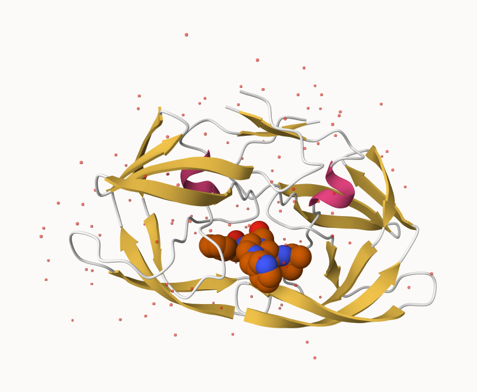

# 2

```{r}
pdb_file <- ("pdb_stats.csv")
pdb_f = read.csv(pdb_file, row.names=1)
head(pdb_f)
```

> Q1: What percentage of structures in the PDB are solved by X-Ray and Electron Microscopy.

```{r}
sum_xray <- sum(pdb_f$X.ray)
sum_xray
```
```{r}
sum_em <- sum(pdb_f$EM)
sum_em
```
```{r}
sum_total <- sum(pdb_f$Total)
sum_total
```
```{r}
percent_xray_em <- ((sum_xray + sum_em)/(sum_total)) * 100
percent_xray_em
```
```{r}
percent_xray <- ((sum_xray)/(sum_total)) * 100
percent_xray
```
```{r}
percent_em <- ((sum_em)/(sum_total)) * 100
percent_em
```


The answer is that in combination they make up 93.79%.  Individually, x-rays make up 80.95% and EMs make up 12.84%.


> Q2: What proportion of structures in the PDB are protein?

```{r}
(178795 + 10363 + 9106)/sum_total
```
The proportion is 0.80.

> Q3: Type HIV in the PDB website search box on the home page and determine how many HIV-1 protease structures are in the current PDB? 

I believe I saw 20. 

# 3 Visualizing the HIV-1 protease structure


> Q4: Water molecules normally have 3 atoms. Why do we see just one atom per water molecule in this structure?

This has to do with how diffraction works.  It likely can't identify the H molecule because of how small it is.

> Q5: There is a critical “conserved” water molecule in the binding site. Can you identify this water molecule? What residue number does this water molecule have

It's hard to identify, but it looks like it is at around 3 angstroms.  It looks like HOH 3##. 

>  Q 6 Generate and save a figure clearly showing the two distinct chains of HIV-protease along with the ligand. You might also consider showing the catalytic residues ASP 25 in each chain and the critical water (we recommend “Ball & Stick” for these side-chains). Add this figure to your Quarto document.





# 4 Introduction to Bio3D in R
```{r}
library(bio3d)

```

```{r}
pdb <- read.pdb("1hsg")

```

```{r}
pdb
```
> Q 7 How many amino acid residues are there in this pdb object?

There are 198 AA residues.
> Q8 Name one of the two non-protein residues? 

They include water (HOH) and MK1.
> Q9 How many protein chains are in this structure?

There are 2 (we also saw this in the image).

```{r}
attributes(pdb)

```

```{r}
head(pdb$atom)

```


```{r}
library(bio3dview)
library(NGLVieweR)

view.pdb(pdb) |>
  setSpin()
```

```{r}
# Select the important ASP 25 residue
sele <- atom.select(pdb, resno=25)

# and highlight them in spacefill representation
view.pdb(pdb, cols=c("navy","teal"), 
         highlight = sele,
         highlight.style = "spacefill") |>
  setRock()
```

```{r}
adk <- read.pdb("6s36")

```

```{r}
adk
```

```{r}
# Perform flexiblity prediction
m <- nma(adk)
```

```{r}
plot(m)

```

```{r}
mktrj(m, file="adk_m7.pdb")

```

```{r}
view.nma(m, pdb=adk)

```


# 5 Comparative structure analysis of Adenylate Kinase
```{r}
# Install packages in the R console NOT your Rmd/Quarto file


```

> Q10. Which of the packages above is found only on BioConductor and not CRAN? 

msa is only on BioConductor.
> Q11. Which of the above packages is not found on BioConductor or CRAN?: 

bio3dview is not on either

> Q12. True or False? Functions from the pak package can be used to install packages from GitHub and BitBucket? 

TRUE
```{r}
library(bio3d)
aa <- get.seq("1ake_A")
```

```{r}
aa
```

> Q13. How many amino acids are in this sequence, i.e. how long is this sequence?

It appears the answer is 214.

```{r}
hits <- NULL
hits$pdb.id <- c('1AKE_A','6S36_A','6RZE_A','3HPR_A','1E4V_A','5EJE_A','1E4Y_A','3X2S_A','6HAP_A','6HAM_A','4K46_A','3GMT_A','4PZL_A')
```


```{r}
# Download releated PDB files
files <- get.pdb(hits$pdb.id, path="pdb", split=TRUE, gzip=TRUE)

```

# Wednesday, February 11

## Comparitive protein structure analysis with PCA

We start with a database id "1ake_A"

```{r}
library(bio3d)

id <- "1ake_A"

aa<- get.seq(id)
```

```{r}
aa
```

```{r}
blast <- blast.pdb(aa)
```

Have a wee peak:
```{r}
head(blast$hit.tbl)
```

```{r}
hits <- plot(blast)
```
Peak ar our top hits
```{r}
head(hits$pdb.id)
```

Now we can download these "top hits" these will all be ADK structures in the PDB database.

```{r}
files <- get.pdb(hits$pdb.id, path="pdbs", split=TRUE, gzip=TRUE)
```
We need one package from BioConductor.  To set this up, we need to first install a package called  **"BiocManager"** from CRAN.

Now we can use the `install()` function from this package like this:
`BiocManager::install("msa")`

```{r}
pdbs <- pdbaln(files, fit=TRUE, exefile="msa")
```

Let's have a wee peak at our structures after "fitting" or superposing:

```{r}
library(bio3dview)
view.pdbs(pdbs)
```

```{r}
view.pdbs(pdbs, colorScheme = "residue")
```

We can run functions like `rmsd()`, `rmsf()` and the best `pca()`
```{r}
pc.xray <- pca(pdbs)
plot(pc.xray)
```
```{r}
plot(pc.xray, 1:2)
```


finally, let;s make a wee movie of the major "motion" or structural difference in the dataset - we call this a "trajectory"

```{r}
mktrj(pc.xray, file="results.pdb")
```


