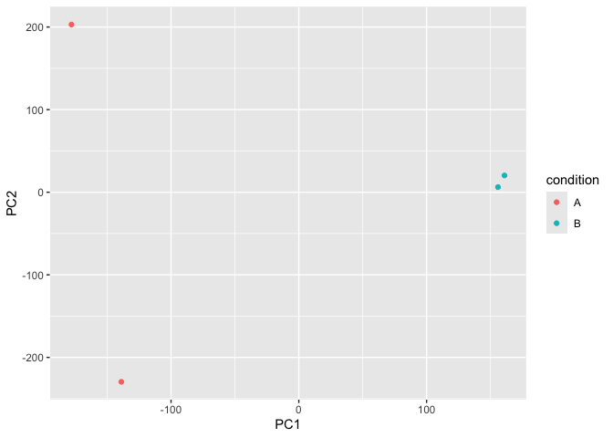
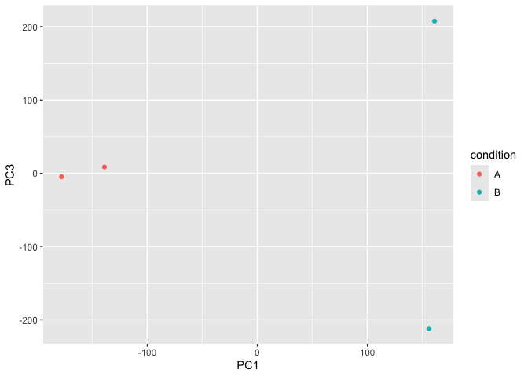
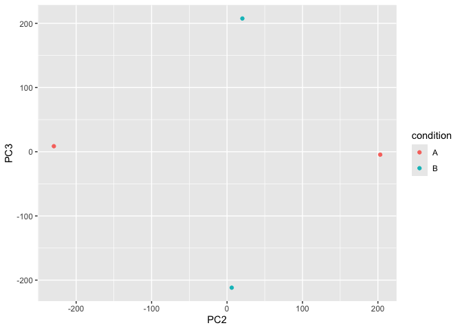

# Class17
Kate Ruiz (PID: A17671200)

## Core Unix commands

Most unix commands have super short names, which makes them quick to
type but annoying to learn. Major file system related commands include:
pwd: Print working directory ls: list files and directories cd: change
directory mkdir: make a new directory rm: remove diles and directories
(delete) super dangerous cp: copy files (source \> destination) mv: move
files or directories (basically rename) nano: a wee text command editor
(very basic but always available)

## AW EC2 Instance

Connect to my instance with:

ssh -i ~/Downloads/bimm143_kate.pem
ubuntu@ec2-34-219-54-212.us-west-2.compute.amazonaws.com

Secure Copy files between machines, in this case from our instance to
our laptop

scp -i ~/Downloads/bimm143_kate.pem
ubuntu@ec2-34-219-54-212.us-west-2.compute.amazonaws.com:/home/ubuntu/work/bimm143_github/class16/results.txt
.

## PCA

``` r
library(tximport)

# setup the folder and file-names to read
folders <- dir(pattern="SRR21568*")
samples <- sub("_quant", "", folders)
files <- file.path( folders, "abundance.h5" )
names(files) <- samples

txi.kallisto <- tximport(files, type = "kallisto", txOut = TRUE)
```

    1 2 3 4 

``` r
head(txi.kallisto$counts)
```

                    SRR2156848 SRR2156849 SRR2156850 SRR2156851
    ENST00000539570          0          0    0.00000          0
    ENST00000576455          0          0    2.62037          0
    ENST00000510508          0          0    0.00000          0
    ENST00000474471          0          1    1.00000          0
    ENST00000381700          0          0    0.00000          0
    ENST00000445946          0          0    0.00000          0

``` r
getwd()
```

    [1] "/Users/kateruiz/Desktop/BIMM 143/bimm143_github/Class17"

``` r
list.files()
```

    [1] "Class17.pdf"       "Class17.qmd"       "Class17.rmarkdown"
    [4] "Class17.Rproj"     "SRR2156848_quant"  "SRR2156849_quant" 
    [7] "SRR2156850_quant"  "SRR2156851_quant" 

``` r
folders <- dir(pattern = "SRR21568")
folders
```

    [1] "SRR2156848_quant" "SRR2156849_quant" "SRR2156850_quant" "SRR2156851_quant"

``` r
samples <- sub("_quant", "", folders)
samples
```

    [1] "SRR2156848" "SRR2156849" "SRR2156850" "SRR2156851"

``` r
files <- file.path(folders, "abundance.h5")
files
```

    [1] "SRR2156848_quant/abundance.h5" "SRR2156849_quant/abundance.h5"
    [3] "SRR2156850_quant/abundance.h5" "SRR2156851_quant/abundance.h5"

``` r
names(files) <- samples
files
```

                         SRR2156848                      SRR2156849 
    "SRR2156848_quant/abundance.h5" "SRR2156849_quant/abundance.h5" 
                         SRR2156850                      SRR2156851 
    "SRR2156850_quant/abundance.h5" "SRR2156851_quant/abundance.h5" 

``` r
txi.kallisto <- tximport(files, type = "kallisto", txOut = TRUE)
```

    1 2 3 4 

``` r
if (!requireNamespace("BiocManager", quietly = TRUE))
    install.packages("BiocManager")

BiocManager::install("rhdf5")
```

    Bioconductor version 3.22 (BiocManager 1.30.27), R 4.5.2 (2025-10-31)

    Warning: package(s) not installed when version(s) same as or greater than current; use
      `force = TRUE` to re-install: 'rhdf5'

    Old packages: 'units'

``` r
colSums(txi.kallisto$counts)
```

    SRR2156848 SRR2156849 SRR2156850 SRR2156851 
       2563611    2600800    2372309    2111474 

``` r
sum(rowSums(txi.kallisto$counts)>0)
```

    [1] 94561

``` r
to.keep <- rowSums(txi.kallisto$counts) > 0
kset.nonzero <- txi.kallisto$counts[to.keep,]
```

``` r
keep2 <- apply(kset.nonzero,1,sd)>0
x <- kset.nonzero[keep2,]
```

``` r
pca <- prcomp(t(x), scale=TRUE)
```

``` r
summary(pca)
```

    Importance of components:
                                PC1      PC2      PC3   PC4
    Standard deviation     183.6379 177.3605 171.3020 1e+00
    Proportion of Variance   0.3568   0.3328   0.3104 1e-05
    Cumulative Proportion    0.3568   0.6895   1.0000 1e+00

``` r
plot(pca$x[,1], pca$x[,2],
     col=c("blue","blue","red","red"),
     xlab="PC1", ylab="PC2", pch=16)
```


``` r
names(pca)
```

    [1] "sdev"     "rotation" "center"   "scale"    "x"       

``` r
head(pca$x)
```

                     PC1         PC2         PC3       PC4
    SRR2156848 -177.9368  203.031882   -4.507483 0.8660196
    SRR2156849 -138.9188 -229.558755    8.656814 0.8659919
    SRR2156850  155.8981    6.206921 -211.755452 0.8660168
    SRR2156851  160.9486   20.312009  207.599341 0.8660462

``` r
df <- as.data.frame(pca$x)
head(df)
```

                     PC1         PC2         PC3       PC4
    SRR2156848 -177.9368  203.031882   -4.507483 0.8660196
    SRR2156849 -138.9188 -229.558755    8.656814 0.8659919
    SRR2156850  155.8981    6.206921 -211.755452 0.8660168
    SRR2156851  160.9486   20.312009  207.599341 0.8660462

``` r
rownames(pca$x)
```

    [1] "SRR2156848" "SRR2156849" "SRR2156850" "SRR2156851"

``` r
colnames(df)
```

    [1] "PC1" "PC2" "PC3" "PC4"

``` r
head(df)
```

                     PC1         PC2         PC3       PC4
    SRR2156848 -177.9368  203.031882   -4.507483 0.8660196
    SRR2156849 -138.9188 -229.558755    8.656814 0.8659919
    SRR2156850  155.8981    6.206921 -211.755452 0.8660168
    SRR2156851  160.9486   20.312009  207.599341 0.8660462

``` r
df$condition <- c("A", "A", "B", "B")
head(df)
```

                     PC1         PC2         PC3       PC4 condition
    SRR2156848 -177.9368  203.031882   -4.507483 0.8660196         A
    SRR2156849 -138.9188 -229.558755    8.656814 0.8659919         A
    SRR2156850  155.8981    6.206921 -211.755452 0.8660168         B
    SRR2156851  160.9486   20.312009  207.599341 0.8660462         B

``` r
head(df)
```

                     PC1         PC2         PC3       PC4 condition
    SRR2156848 -177.9368  203.031882   -4.507483 0.8660196         A
    SRR2156849 -138.9188 -229.558755    8.656814 0.8659919         A
    SRR2156850  155.8981    6.206921 -211.755452 0.8660168         B
    SRR2156851  160.9486   20.312009  207.599341 0.8660462         B

``` r
library(ggplot2)
ggplot(df, aes(x = PC1 , y = PC2 , color = condition)) +
  geom_point()
```



``` r
ggplot(df, aes(x = PC1 , y = PC3 , color = condition)) +
  geom_point()
```



``` r
ggplot(df, aes(x = PC2 , y = PC3 , color = condition)) +
  geom_point()
```


