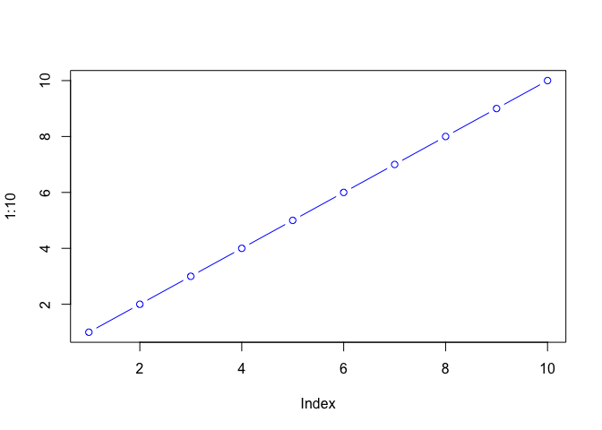

# class06: R projects
Kate Ruiz (PID: A17671200)

- [Background](#background)
- [A first function](#a-first-function)
- [A second function](#a-second-function)
- [by default the last thing you type is what you
  get](#by-default-the-last-thing-you-type-is-what-you-get)
  - [A new col function](#a-new-col-function)

## Background

Functions are at the heart of using R. Everything we do involves calling
and using functions (from data input, analysis to results output).

All functions in R have at least 3 things:

1.  A **name** the thing we use to call the function.
2.  One or more input **arguments** that are comma separated
3.  The **body**, lines of code between curly brackets {} that does the
    work of the function.

## A first function

Let’s write a silly wee function to add some numbers:

``` r
add <- function(x) {
  x + 1 
}
```

Let’s try it out

``` r
add(100)
```

    [1] 101

Will this work

``` r
add(c(100,200,300))
```

    [1] 101 201 301

Modify to be more useful and add more than just 1

``` r
add <- function(x, y=1) {
  x + y 
}
```

``` r
add(100, 10)
```

    [1] 110

Will this work?

``` r
add(100,0)
```

    [1] 100

``` r
plot(1:10, col="blue", typ="b")
```



``` r
log(10, base=10)
```

    [1] 1

> **Note to Kate** Input arguments can be either **required** or
> **optional**. The later have a fall-back default that is specified in
> the function code with an equals sign.

``` r
#add(x=100, y=200, z=300)
```

## A second function

all functions in R look like this

    name <- function(arg) {
      body
    }

The `sample()` function in R …

``` r
sample(1:10, size=4)
```

    [1]  8 10  4  3

> Q. Return 12 numbers picked randomly from the input 1:10

``` r
sample(1:10, size=12, replace=TRUE)
```

     [1]  5  4 10  2  1  9  7  5  2  7  5  4

> Q. Write the code to generate a random 12 nucleotide long DNA
> sequence?

``` r
nucleotide <- c("A", "T", "G", "C")
sample(nucleotide, size=12, replace=TRUE)
```

     [1] "A" "C" "G" "G" "A" "C" "C" "A" "G" "G" "T" "A"

> 17. Write a first version function called `generate_dna()` that
>     generates a user specified length `n` random DNA sequence?

    name <- function(arg) {
      body
    }

``` r
generate_dna <-function(n=6){
  nucleotide <- c("A", "T", "G", "C")
  sample(nucleotide, size=n, replace=TRUE)
}
```

``` r
generate_dna(100)
```

      [1] "A" "G" "C" "G" "G" "A" "C" "G" "G" "A" "G" "T" "A" "C" "G" "A" "A" "C"
     [19] "T" "C" "A" "T" "T" "A" "G" "T" "A" "C" "G" "A" "G" "A" "G" "G" "C" "T"
     [37] "T" "C" "G" "T" "A" "C" "G" "A" "T" "G" "A" "A" "A" "G" "T" "C" "A" "A"
     [55] "T" "C" "T" "G" "A" "C" "G" "G" "A" "A" "C" "G" "G" "A" "A" "T" "G" "G"
     [73] "C" "C" "G" "T" "T" "G" "C" "G" "G" "G" "G" "C" "G" "T" "C" "C" "T" "T"
     [91] "G" "G" "C" "C" "T" "G" "C" "C" "A" "A"

> Q. Modify your function to return a FASTA like sequence so rather than
> \[1\] “G” “T” “T” “G” “T” “C” “G” “A” “G” “G” “A” “G” we want “GTTG…”

``` r
generate_dna <-function(n=6){
  nucleotide <- c("A", "T", "G", "C")
  sally<-sample(nucleotide, size=n, replace=TRUE)
  sally <- paste(sally, collapse="")
  return(sally)
}
```

## by default the last thing you type is what you get

``` r
generate_dna(10)
```

    [1] "GAGCCCTAGT"

> Q *bingus is a hairless cat* Give the user an option to return FASTA
> format output ssequence or standard multi-element vector format

``` r
generate_dna <-function(n=6, fasta=TRUE){
  nucleotide <- c("A", "T", "G", "C")
  sally<-sample(nucleotide, size=n, replace=TRUE)
  
  if(fasta){
    sally <- paste(sally, collapse="")
    cat("Helllooooooo")

  }
  return(sally)
}
```

``` r
generate_dna(10, fasta=T)
```

    Helllooooooo

    [1] "CCTTCTGCAT"

### A new col function

> Q. Write a function called `generate_protein()` that generates a user
> specified length protein sequence in FASTA like format?

> Q. Use your new `generate_protein()` function to generate sequences
> between length 6 and 12 amino acids in length and check if any of
> these are unique in nature (i.e. found in the NR database at NCBI)

``` r
generate_protein <- function(n, fasta=TRUE){
  amino_acids <- c("A","R","N","D","C",
  "E","Q","G","H","I",
  "L","K","M","F","P",
  "S","T","W","Y","V")
  more<-sample(amino_acids, size=n, replace=TRUE)
  if(fasta){
    more<-paste(more, collapse ="")
  }
  return(more)
}
```

``` r
generate_protein(6, T)
```

    [1] "ITIENK"

``` r
generate_protein(7, T)
```

    [1] "REYCIKM"

``` r
generate_protein(8, T)
```

    [1] "DICPRVTM"

``` r
generate_protein(9, T)
```

    [1] "FTCHGEGDY"

``` r
generate_protein(10, T)
```

    [1] "DFYLIYIVDP"

``` r
generate_protein(11, T)
```

    [1] "YQQIMHNVCIG"

``` r
generate_protein(12, T)
```

    [1] "NAHAHYFNNFHS"

Or we could do a `for()` loop:

``` r
for (i in 6:12) {
  cat(i, "\n")
}
```

    6 
    7 
    8 
    9 
    10 
    11 
    12 

``` r
for (i in 6:12) {
  cat(">", i,sep="", "\n")
  cat(generate_protein(i), "\n")
}
```

    >6
    MSEWSY 
    >7
    YLQMGPG 
    >8
    INAIMMVP 
    >9
    PTGGPGWFT 
    >10
    RTLQMGMALT 
    >11
    IIWHCGAQKID 
    >12
    RICPADTFRPPM 

> id AGKRT
