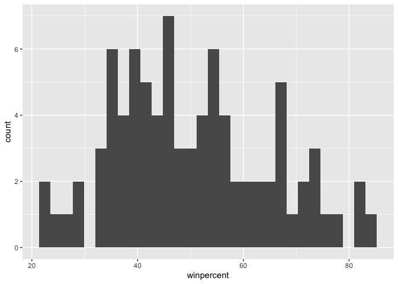
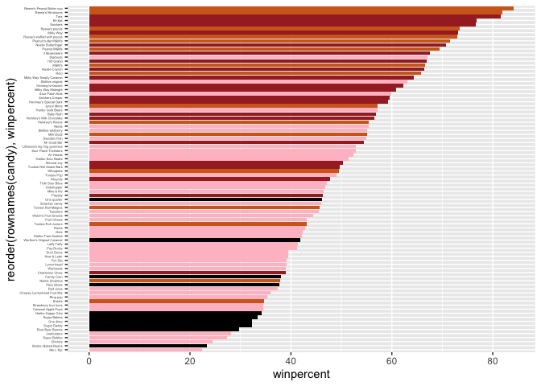
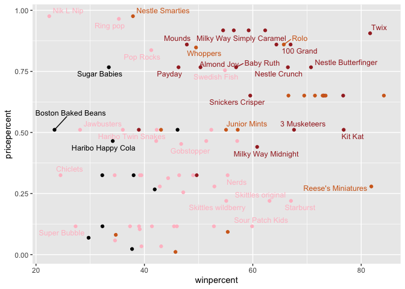
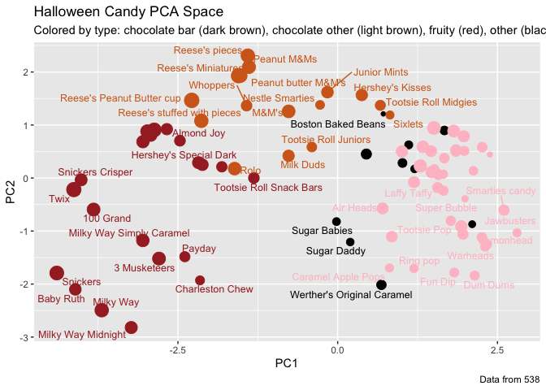
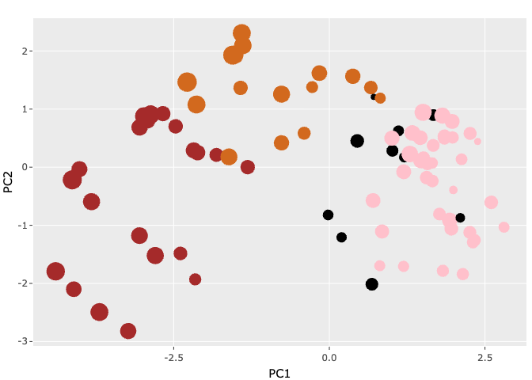

# Class 09
Kate Ruiz (PID A17671200)

# 2. Importing Candy Data

``` r
candy_file <- "candy-data.csv"

candy = read.csv(candy_file, row.names=1)
head(candy)
```

                 chocolate fruity caramel peanutyalmondy nougat crispedricewafer
    100 Grand            1      0       1              0      0                1
    3 Musketeers         1      0       0              0      1                0
    One dime             0      0       0              0      0                0
    One quarter          0      0       0              0      0                0
    Air Heads            0      1       0              0      0                0
    Almond Joy           1      0       0              1      0                0
                 hard bar pluribus sugarpercent pricepercent winpercent
    100 Grand       0   1        0        0.732        0.860   66.97173
    3 Musketeers    0   1        0        0.604        0.511   67.60294
    One dime        0   0        0        0.011        0.116   32.26109
    One quarter     0   0        0        0.011        0.511   46.11650
    Air Heads       0   0        0        0.906        0.511   52.34146
    Almond Joy      0   1        0        0.465        0.767   50.34755

## 2.1 What is in this data set?

> Q1. How many different candy types are in this dataset?

There are 85 different candies.

``` r
dim(candy)
```

    [1] 85 12

``` r
nrow(candy)
```

    [1] 85

``` r
sum(candy$fruity)
```

    [1] 38

> Q2. How many fruity candy types are in the dataset?

There are 38 fruity candy types in this data set.

## 2.2 What is your favorite candy?

``` r
candy["Twix", ]$winpercent
```

    [1] 81.64291

``` r
library(dplyr)
```


    Attaching package: 'dplyr'

    The following objects are masked from 'package:stats':

        filter, lag

    The following objects are masked from 'package:base':

        intersect, setdiff, setequal, union

``` r
candy |> 
  filter(row.names(candy)=="Twix") |> 
  select(winpercent)
```

         winpercent
    Twix   81.64291

> Q3. What is your favorite candy (other than Twix) in the dataset and
> what is it’s winpercent value?

The candy I chose other than Twix is Almond Joy. The winpercent value is
50.3475.

``` r
candy["Almond Joy", ]$winpercent
```

    [1] 50.34755

> Q4. What is the winpercent value for “Kit Kat”?

The winpercent value for Kit Kat is 76.7686.

``` r
candy["Kit Kat", ]$winpercent
```

    [1] 76.7686

> Q5. What is the winpercent value for “Tootsie Roll Snack Bars”?

The winpercent value for tootsie roll snack bars is 49.6535.

``` r
candy["Tootsie Roll Snack Bars", ]$winpercent
```

    [1] 49.6535

### side note: the skimr::skim() function

``` r
library("skimr")
skim(candy)
```

|                                                  |       |
|:-------------------------------------------------|:------|
| Name                                             | candy |
| Number of rows                                   | 85    |
| Number of columns                                | 12    |
| \_\_\_\_\_\_\_\_\_\_\_\_\_\_\_\_\_\_\_\_\_\_\_   |       |
| Column type frequency:                           |       |
| numeric                                          | 12    |
| \_\_\_\_\_\_\_\_\_\_\_\_\_\_\_\_\_\_\_\_\_\_\_\_ |       |
| Group variables                                  | None  |

Data summary

**Variable type: numeric**

| skim_variable | n_missing | complete_rate | mean | sd | p0 | p25 | p50 | p75 | p100 | hist |
|:---|---:|---:|---:|---:|---:|---:|---:|---:|---:|:---|
| chocolate | 0 | 1 | 0.44 | 0.50 | 0.00 | 0.00 | 0.00 | 1.00 | 1.00 | ▇▁▁▁▆ |
| fruity | 0 | 1 | 0.45 | 0.50 | 0.00 | 0.00 | 0.00 | 1.00 | 1.00 | ▇▁▁▁▆ |
| caramel | 0 | 1 | 0.16 | 0.37 | 0.00 | 0.00 | 0.00 | 0.00 | 1.00 | ▇▁▁▁▂ |
| peanutyalmondy | 0 | 1 | 0.16 | 0.37 | 0.00 | 0.00 | 0.00 | 0.00 | 1.00 | ▇▁▁▁▂ |
| nougat | 0 | 1 | 0.08 | 0.28 | 0.00 | 0.00 | 0.00 | 0.00 | 1.00 | ▇▁▁▁▁ |
| crispedricewafer | 0 | 1 | 0.08 | 0.28 | 0.00 | 0.00 | 0.00 | 0.00 | 1.00 | ▇▁▁▁▁ |
| hard | 0 | 1 | 0.18 | 0.38 | 0.00 | 0.00 | 0.00 | 0.00 | 1.00 | ▇▁▁▁▂ |
| bar | 0 | 1 | 0.25 | 0.43 | 0.00 | 0.00 | 0.00 | 0.00 | 1.00 | ▇▁▁▁▂ |
| pluribus | 0 | 1 | 0.52 | 0.50 | 0.00 | 0.00 | 1.00 | 1.00 | 1.00 | ▇▁▁▁▇ |
| sugarpercent | 0 | 1 | 0.48 | 0.28 | 0.01 | 0.22 | 0.47 | 0.73 | 0.99 | ▇▇▇▇▆ |
| pricepercent | 0 | 1 | 0.47 | 0.29 | 0.01 | 0.26 | 0.47 | 0.65 | 0.98 | ▇▇▇▇▆ |
| winpercent | 0 | 1 | 50.32 | 14.71 | 22.45 | 39.14 | 47.83 | 59.86 | 84.18 | ▃▇▆▅▂ |

> Q6. Is there any variable/column that looks to be on a different scale
> to the majority of the other columns in the dataset?

winpercent seems to be on a different scale. It looks like a percentage
as opposed to a proportion.

> Q7. What do you think a zero and one represent for the
> candy\$chocolate column?

I think it’s a binary for yes and no. 0 is likely no and 1 is likely
yes.

``` r
skim(candy$chocolate)
```

|                                                  |                  |
|:-------------------------------------------------|:-----------------|
| Name                                             | candy\$chocolate |
| Number of rows                                   | 85               |
| Number of columns                                | 1                |
| \_\_\_\_\_\_\_\_\_\_\_\_\_\_\_\_\_\_\_\_\_\_\_   |                  |
| Column type frequency:                           |                  |
| numeric                                          | 1                |
| \_\_\_\_\_\_\_\_\_\_\_\_\_\_\_\_\_\_\_\_\_\_\_\_ |                  |
| Group variables                                  | None             |

Data summary

**Variable type: numeric**

| skim_variable | n_missing | complete_rate | mean |  sd |  p0 | p25 | p50 | p75 | p100 | hist  |
|:--------------|----------:|--------------:|-----:|----:|----:|----:|----:|----:|-----:|:------|
| data          |         0 |             1 | 0.44 | 0.5 |   0 |   0 |   0 |   1 |    1 | ▇▁▁▁▆ |

# 3 Exploratory Analysis

> Q8. Plot a histogram of winpercent values using both base R an
> ggplot2.

``` r
hist(candy$winpercent)
```


``` r
library(ggplot2)
ggplot(candy, aes(x=winpercent)) +
  geom_histogram()
```

    `stat_bin()` using `bins = 30`. Pick better value `binwidth`.



> Q9. Is the distribution of winpercent values symmetrical?

It does not look very symmetrical. It looks skewed to the right.

> Q10. Is the center of the distribution above or below 50%?

``` r
median(candy$winpercent)
```

    [1] 47.82975

The center of the distribution is below 50% at 47.83%.

> Q11. On average is chocolate candy higher or lower ranked than fruit
> candy?

``` r
fruity_candy <- candy$winpercent[as.logical(candy$fruity)]
```

``` r
chocolate_candy <- candy$winpercent[as.logical(candy$chocolate)]
```

``` r
mean(fruity_candy)
```

    [1] 44.11974

``` r
mean(chocolate_candy)
```

    [1] 60.92153

On average, chocolate candy is more highly ranked (60.92%) than fruity
candy (44.12%).

> Q12. Is this difference statistically significant?

``` r
t.test(chocolate_candy, fruity_candy)
```


        Welch Two Sample t-test

    data:  chocolate_candy and fruity_candy
    t = 6.2582, df = 68.882, p-value = 2.871e-08
    alternative hypothesis: true difference in means is not equal to 0
    95 percent confidence interval:
     11.44563 22.15795
    sample estimates:
    mean of x mean of y 
     60.92153  44.11974 

The difference is statistically significant as the p value is less than
or equal to .05 (p=2.871e-08).

# 4 Overall Candy Rankings

> Q13. What are the five least liked candy types in this set?

The five least liked candy types in this set are Nik L Nip, Boston Baked
Beans, Chiclets, Super Bubble, and Jawbusters.

``` r
candy |> arrange(winpercent) |> head(5)
```

                       chocolate fruity caramel peanutyalmondy nougat
    Nik L Nip                  0      1       0              0      0
    Boston Baked Beans         0      0       0              1      0
    Chiclets                   0      1       0              0      0
    Super Bubble               0      1       0              0      0
    Jawbusters                 0      1       0              0      0
                       crispedricewafer hard bar pluribus sugarpercent pricepercent
    Nik L Nip                         0    0   0        1        0.197        0.976
    Boston Baked Beans                0    0   0        1        0.313        0.511
    Chiclets                          0    0   0        1        0.046        0.325
    Super Bubble                      0    0   0        0        0.162        0.116
    Jawbusters                        0    1   0        1        0.093        0.511
                       winpercent
    Nik L Nip            22.44534
    Boston Baked Beans   23.41782
    Chiclets             24.52499
    Super Bubble         27.30386
    Jawbusters           28.12744

> Q14. What are the top 5 all time favorite candy types out of this set?

The 5 all time favorite candies out of this data set are Snickers, Kit
Kat, Twix, Reese’s Miniatures, and Reese’s Peanut Butter cup.

``` r
candy |> arrange(winpercent) |> tail(5)
```

                              chocolate fruity caramel peanutyalmondy nougat
    Snickers                          1      0       1              1      1
    Kit Kat                           1      0       0              0      0
    Twix                              1      0       1              0      0
    Reese's Miniatures                1      0       0              1      0
    Reese's Peanut Butter cup         1      0       0              1      0
                              crispedricewafer hard bar pluribus sugarpercent
    Snickers                                 0    0   1        0        0.546
    Kit Kat                                  1    0   1        0        0.313
    Twix                                     1    0   1        0        0.546
    Reese's Miniatures                       0    0   0        0        0.034
    Reese's Peanut Butter cup                0    0   0        0        0.720
                              pricepercent winpercent
    Snickers                         0.651   76.67378
    Kit Kat                          0.511   76.76860
    Twix                             0.906   81.64291
    Reese's Miniatures               0.279   81.86626
    Reese's Peanut Butter cup        0.651   84.18029

> Q15.Make a first barplot of candy ranking based on winpercent values.

``` r
library(ggplot2)

ggplot(candy) + 
  aes(winpercent, rownames(candy)) +
  geom_col()
```


> Q16. This is quite ugly, use the reorder() function to get the bars
> sorted by winpercent?

``` r
ggplot(candy) + 
  aes(winpercent, reorder(rownames(candy),winpercent)) +
  geom_col() + 
  theme(axis.text.y = element_text(size = 3))
```


## 4.1 Time to add some useful color

``` r
my_cols=rep("black", nrow(candy))
my_cols[as.logical(candy$chocolate)] = "chocolate"
my_cols[as.logical(candy$bar)] = "brown"
my_cols[as.logical(candy$fruity)] = "pink"
```

``` r
ggplot(candy) + 
  aes(winpercent, reorder(rownames(candy),winpercent)) +
  geom_col(fill=my_cols) +
  theme(axis.text.y = element_text(size = 3))
```



> Q17. What is the worst ranked chocolate candy?

The worst ranked chocolate candy are sixlets. \> Q18. What is the best
ranked fruity candy?

The best ranked fruity candy are starburst.

# 5 Taking a look at pricepercent

``` r
library(ggrepel)

# How about a plot of win vs price
ggplot(candy) +
  aes(winpercent, pricepercent, label=rownames(candy)) +
  geom_point(col=my_cols) + 
  geom_text_repel(col=my_cols, size=3.3, max.overlaps = 5)
```



> Q19. Which candy type is the highest ranked in terms of winpercent for
> the least money - i.e. offers the most bang for your buck?

Tootsie Roll Midgies have the highest winpercent for the lowest
pricepercent.

``` r
best <- candy$winpercent / candy$pricepercent

candy[which.max(best), c("winpercent", "pricepercent")]
```

                         winpercent pricepercent
    Tootsie Roll Midgies   45.73675        0.011

> Q20. What are the top 5 most expensive candy types in the dataset and
> of these which is the least popular?

The tip 5 most expensive candy types are Nik L Nip, Nestle Smarties,
Ring Pop, Hershey’s Krackel, and Hershey’s Milk Chocolate. Of these the
least popular is Nik L Nip.

``` r
ord <- order(candy$pricepercent, decreasing = TRUE)
head( candy[ord,c(11,12)], n=5 )
```

                             pricepercent winpercent
    Nik L Nip                       0.976   22.44534
    Nestle Smarties                 0.976   37.88719
    Ring pop                        0.965   35.29076
    Hershey's Krackel               0.918   62.28448
    Hershey's Milk Chocolate        0.918   56.49050

# 6 Exploring the correlation structure

``` r
library(corrplot)
```

    corrplot 0.95 loaded

``` r
cij <- cor(candy)
corrplot(cij)
```


> Q22. Examining this plot what two variables are anti-correlated
> (i.e. have minus values)?

It seems like fruity and a variety of things. Of note are fruity and
chocolate, fruity and bar, and pluribus and bar (among others). \> Q23.
Similarly, what two variables are most positively correlated?

It looks like it would be chocolate and bar. It seems many chocolate +
XX pairs are blue (positively correlated).

# 7 Principal Component Analysis

``` r
pca <- prcomp(candy, scale = TRUE)
summary(pca)
```

    Importance of components:
                              PC1    PC2    PC3     PC4    PC5     PC6     PC7
    Standard deviation     2.0788 1.1378 1.1092 1.07533 0.9518 0.81923 0.81530
    Proportion of Variance 0.3601 0.1079 0.1025 0.09636 0.0755 0.05593 0.05539
    Cumulative Proportion  0.3601 0.4680 0.5705 0.66688 0.7424 0.79830 0.85369
                               PC8     PC9    PC10    PC11    PC12
    Standard deviation     0.74530 0.67824 0.62349 0.43974 0.39760
    Proportion of Variance 0.04629 0.03833 0.03239 0.01611 0.01317
    Cumulative Proportion  0.89998 0.93832 0.97071 0.98683 1.00000

``` r
plot(pca$x[ ,1:2])
```


``` r
plot(pca$x[,1:2], col=my_cols, pch=16)
```


``` r
# Make a new data-frame with our PCA results and candy data
my_data <- cbind(candy, pca$x[,1:3])
```

``` r
p <- ggplot(my_data) + 
        aes(x=PC1, y=PC2, 
            size=winpercent/100,  
            text=rownames(my_data),
            label=rownames(my_data)) +
        geom_point(col=my_cols)

p
```


``` r
library(ggrepel)

p + geom_text_repel(size=3.3, col=my_cols, max.overlaps = 7)  + 
  theme(legend.position = "none") +
  labs(title="Halloween Candy PCA Space",
       subtitle="Colored by type: chocolate bar (dark brown), chocolate other (light brown), fruity (red), other (black)",
       caption="Data from 538")
```



``` r
library(plotly)
```


    Attaching package: 'plotly'

    The following object is masked from 'package:ggplot2':

        last_plot

    The following object is masked from 'package:stats':

        filter

    The following object is masked from 'package:graphics':

        layout

``` r
ggplotly(p)
```



``` r
ggplot(pca$rotation) +
  aes(x = PC1, y = reorder(rownames(pca$rotation), PC1)) +
  geom_col()
```


> Q24. Complete the code to generate the loadings plot above. What
> original variables are picked up strongly by PC1 in the positive
> direction? Do these make sense to you? Where did you see this
> relationship highlighted previously?

In the positive direction, fruity, pluribus, and hard are picked up. It
feels a little confusing. They were negatively/ anticorrelated
previously.

# 8 Summary

> Q25. Based on your exploratory analysis, correlation findings, and PCA
> results, what combination of characteristics appears to make a
> “winning” candy? How do these different analyses (visualization,
> correlation, PCA) support or complement each other in reaching this
> conclusion?

The winning candy has chocolate, nougat, bars, and peanutyalmondy. The
visualizations allowed us to look at costs and like-ability. The
correlations helped us see the best combinations that led to better
liking. PCA provided predictive powers.
