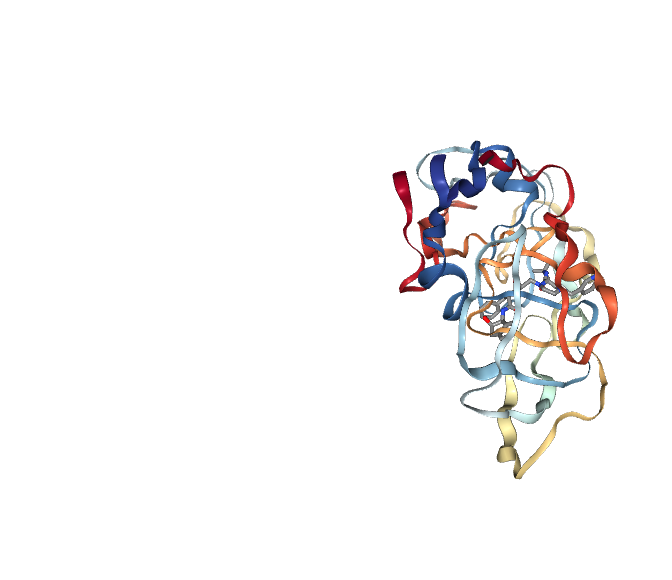
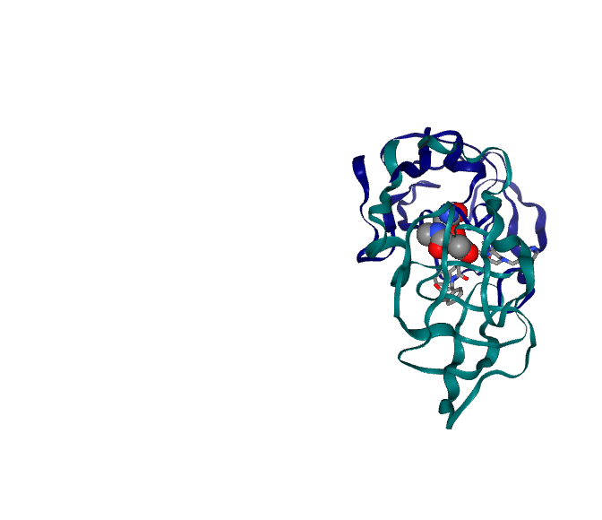
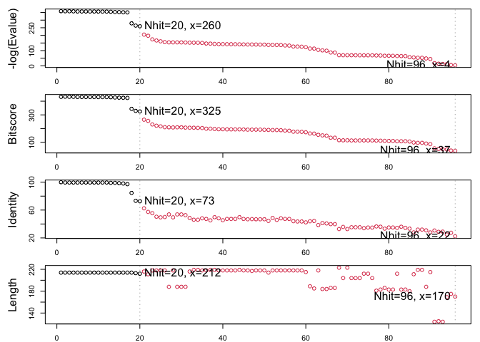
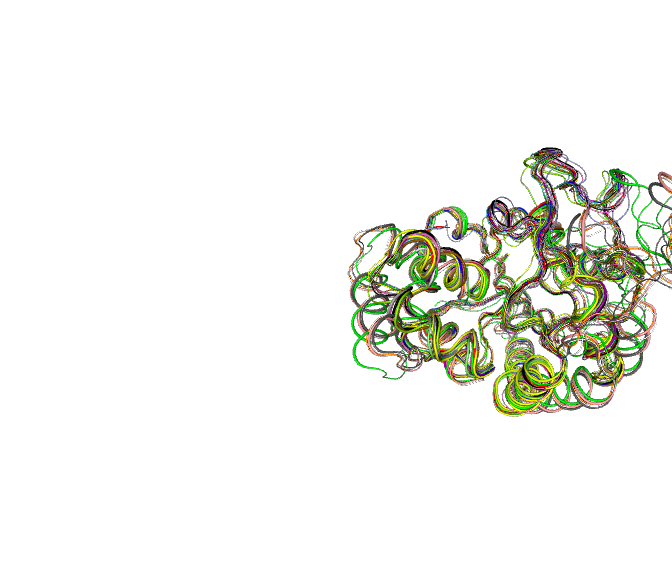
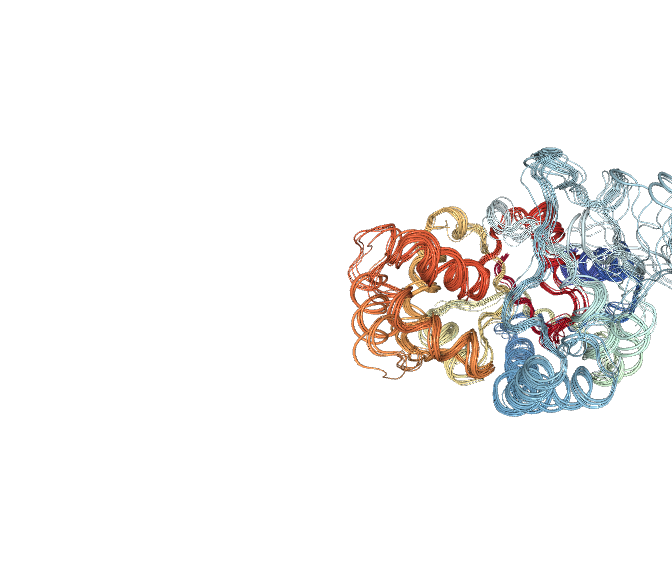
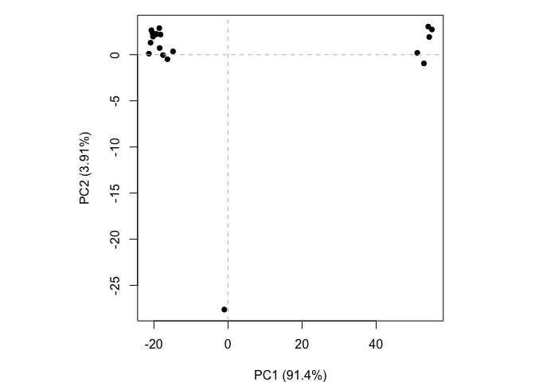

# Class10
Kate Ruiz (PID: A17671200)

# 2

``` r
pdb_file <- ("pdb_stats.csv")
pdb_f = read.csv(pdb_file, row.names=1)
head(pdb_f)
```

                             X.ray    EM   NMR Integrative Multiple.methods Neutron
    Protein (only)          178795 21825 12773         343              226      84
    Protein/Oligosaccharide  10363  3564    34           8               11       1
    Protein/NA                9106  6335   287          24                7       0
    Nucleic acid (only)       3132   221  1566           3               15       3
    Other                      175    25    33           4                0       0
    Oligosaccharide (only)      11     0     6           0                1       0
                            Other  Total
    Protein (only)             32 214078
    Protein/Oligosaccharide     0  13981
    Protein/NA                  0  15759
    Nucleic acid (only)         1   4941
    Other                       0    237
    Oligosaccharide (only)      4     22

> Q1: What percentage of structures in the PDB are solved by X-Ray and
> Electron Microscopy.

``` r
sum_xray <- sum(pdb_f$X.ray)
sum_xray
```

    [1] 201582

``` r
sum_em <- sum(pdb_f$EM)
sum_em
```

    [1] 31970

``` r
sum_total <- sum(pdb_f$Total)
sum_total
```

    [1] 249018

``` r
percent_xray_em <- ((sum_xray + sum_em)/(sum_total)) * 100
percent_xray_em
```

    [1] 93.7892

``` r
percent_xray <- ((sum_xray)/(sum_total)) * 100
percent_xray
```

    [1] 80.95077

``` r
percent_em <- ((sum_em)/(sum_total)) * 100
percent_em
```

    [1] 12.83843

The answer is that in combination they make up 93.79%. Individually,
x-rays make up 80.95% and EMs make up 12.84%.

> Q2: What proportion of structures in the PDB are protein?

``` r
(178795 + 10363 + 9106)/sum_total
```

    [1] 0.7961834

The proportion is 0.80.

> Q3: Type HIV in the PDB website search box on the home page and
> determine how many HIV-1 protease structures are in the current PDB?

I believe I saw 20.

# 3 Visualizing the HIV-1 protease structure

> Q4: Water molecules normally have 3 atoms. Why do we see just one atom
> per water molecule in this structure?

This has to do with how diffraction works. It likely can’t identify the
H molecule because of how small it is.

> Q5: There is a critical “conserved” water molecule in the binding
> site. Can you identify this water molecule? What residue number does
> this water molecule have

It’s hard to identify, but it looks like it is at around 3 angstroms. It
looks like HOH 3##.

> Q 6 Generate and save a figure clearly showing the two distinct chains
> of HIV-protease along with the ligand. You might also consider showing
> the catalytic residues ASP 25 in each chain and the critical water (we
> recommend “Ball & Stick” for these side-chains). Add this figure to
> your Quarto document.


# 4 Introduction to Bio3D in R

``` r
library(bio3d)
```

``` r
pdb <- read.pdb("1hsg")
```

      Note: Accessing on-line PDB file

``` r
pdb
```


     Call:  read.pdb(file = "1hsg")

       Total Models#: 1
         Total Atoms#: 1686,  XYZs#: 5058  Chains#: 2  (values: A B)

         Protein Atoms#: 1514  (residues/Calpha atoms#: 198)
         Nucleic acid Atoms#: 0  (residues/phosphate atoms#: 0)

         Non-protein/nucleic Atoms#: 172  (residues: 128)
         Non-protein/nucleic resid values: [ HOH (127), MK1 (1) ]

       Protein sequence:
          PQITLWQRPLVTIKIGGQLKEALLDTGADDTVLEEMSLPGRWKPKMIGGIGGFIKVRQYD
          QILIEICGHKAIGTVLVGPTPVNIIGRNLLTQIGCTLNFPQITLWQRPLVTIKIGGQLKE
          ALLDTGADDTVLEEMSLPGRWKPKMIGGIGGFIKVRQYDQILIEICGHKAIGTVLVGPTP
          VNIIGRNLLTQIGCTLNF

    + attr: atom, xyz, seqres, helix, sheet,
            calpha, remark, call

> Q 7 How many amino acid residues are there in this pdb object?

There are 198 AA residues. \> Q8 Name one of the two non-protein
residues?

They include water (HOH) and MK1. \> Q9 How many protein chains are in
this structure?

There are 2 (we also saw this in the image).

``` r
attributes(pdb)
```

    $names
    [1] "atom"   "xyz"    "seqres" "helix"  "sheet"  "calpha" "remark" "call"  

    $class
    [1] "pdb" "sse"

``` r
head(pdb$atom)
```

      type eleno elety  alt resid chain resno insert      x      y     z o     b
    1 ATOM     1     N <NA>   PRO     A     1   <NA> 29.361 39.686 5.862 1 38.10
    2 ATOM     2    CA <NA>   PRO     A     1   <NA> 30.307 38.663 5.319 1 40.62
    3 ATOM     3     C <NA>   PRO     A     1   <NA> 29.760 38.071 4.022 1 42.64
    4 ATOM     4     O <NA>   PRO     A     1   <NA> 28.600 38.302 3.676 1 43.40
    5 ATOM     5    CB <NA>   PRO     A     1   <NA> 30.508 37.541 6.342 1 37.87
    6 ATOM     6    CG <NA>   PRO     A     1   <NA> 29.296 37.591 7.162 1 38.40
      segid elesy charge
    1  <NA>     N   <NA>
    2  <NA>     C   <NA>
    3  <NA>     C   <NA>
    4  <NA>     O   <NA>
    5  <NA>     C   <NA>
    6  <NA>     C   <NA>

``` r
library(bio3dview)
library(NGLVieweR)

view.pdb(pdb) |>
  setSpin()
```



``` r
# Select the important ASP 25 residue
sele <- atom.select(pdb, resno=25)

# and highlight them in spacefill representation
view.pdb(pdb, cols=c("navy","teal"), 
         highlight = sele,
         highlight.style = "spacefill") |>
  setRock()
```



``` r
adk <- read.pdb("6s36")
```

      Note: Accessing on-line PDB file
       PDB has ALT records, taking A only, rm.alt=TRUE

``` r
adk
```


     Call:  read.pdb(file = "6s36")

       Total Models#: 1
         Total Atoms#: 1898,  XYZs#: 5694  Chains#: 1  (values: A)

         Protein Atoms#: 1654  (residues/Calpha atoms#: 214)
         Nucleic acid Atoms#: 0  (residues/phosphate atoms#: 0)

         Non-protein/nucleic Atoms#: 244  (residues: 244)
         Non-protein/nucleic resid values: [ CL (3), HOH (238), MG (2), NA (1) ]

       Protein sequence:
          MRIILLGAPGAGKGTQAQFIMEKYGIPQISTGDMLRAAVKSGSELGKQAKDIMDAGKLVT
          DELVIALVKERIAQEDCRNGFLLDGFPRTIPQADAMKEAGINVDYVLEFDVPDELIVDKI
          VGRRVHAPSGRVYHVKFNPPKVEGKDDVTGEELTTRKDDQEETVRKRLVEYHQMTAPLIG
          YYSKEAEAGNTKYAKVDGTKPVAEVRADLEKILG

    + attr: atom, xyz, seqres, helix, sheet,
            calpha, remark, call

``` r
# Perform flexiblity prediction
m <- nma(adk)
```

     Building Hessian...        Done in 0.01 seconds.
     Diagonalizing Hessian...   Done in 0.05 seconds.

``` r
plot(m)
```


``` r
mktrj(m, file="adk_m7.pdb")
```

``` r
view.nma(m, pdb=adk)
```


# 5 Comparative structure analysis of Adenylate Kinase

``` r
# Install packages in the R console NOT your Rmd/Quarto file
```

> Q10. Which of the packages above is found only on BioConductor and not
> CRAN?

msa is only on BioConductor. \> Q11. Which of the above packages is not
found on BioConductor or CRAN?:

bio3dview is not on either

> Q12. True or False? Functions from the pak package can be used to
> install packages from GitHub and BitBucket?

TRUE

``` r
library(bio3d)
aa <- get.seq("1ake_A")
```

    Warning in get.seq("1ake_A"): Removing existing file: seqs.fasta

    Fetching... Please wait. Done.

``` r
aa
```

                 1        .         .         .         .         .         60 
    pdb|1AKE|A   MRIILLGAPGAGKGTQAQFIMEKYGIPQISTGDMLRAAVKSGSELGKQAKDIMDAGKLVT
                 1        .         .         .         .         .         60 

                61        .         .         .         .         .         120 
    pdb|1AKE|A   DELVIALVKERIAQEDCRNGFLLDGFPRTIPQADAMKEAGINVDYVLEFDVPDELIVDRI
                61        .         .         .         .         .         120 

               121        .         .         .         .         .         180 
    pdb|1AKE|A   VGRRVHAPSGRVYHVKFNPPKVEGKDDVTGEELTTRKDDQEETVRKRLVEYHQMTAPLIG
               121        .         .         .         .         .         180 

               181        .         .         .   214 
    pdb|1AKE|A   YYSKEAEAGNTKYAKVDGTKPVAEVRADLEKILG
               181        .         .         .   214 

    Call:
      read.fasta(file = outfile)

    Class:
      fasta

    Alignment dimensions:
      1 sequence rows; 214 position columns (214 non-gap, 0 gap) 

    + attr: id, ali, call

> Q13. How many amino acids are in this sequence, i.e. how long is this
> sequence?

It appears the answer is 214.

``` r
hits <- NULL
hits$pdb.id <- c('1AKE_A','6S36_A','6RZE_A','3HPR_A','1E4V_A','5EJE_A','1E4Y_A','3X2S_A','6HAP_A','6HAM_A','4K46_A','3GMT_A','4PZL_A')
```

``` r
# Download releated PDB files
files <- get.pdb(hits$pdb.id, path="pdb", split=TRUE, gzip=TRUE)
```

    Warning in get.pdb(hits$pdb.id, path = "pdb", split = TRUE, gzip = TRUE):
    pdb/1AKE.pdb.gz exists. Skipping download

    Warning in get.pdb(hits$pdb.id, path = "pdb", split = TRUE, gzip = TRUE):
    pdb/6S36.pdb.gz exists. Skipping download

    Warning in get.pdb(hits$pdb.id, path = "pdb", split = TRUE, gzip = TRUE):
    pdb/6RZE.pdb.gz exists. Skipping download

    Warning in get.pdb(hits$pdb.id, path = "pdb", split = TRUE, gzip = TRUE):
    pdb/3HPR.pdb.gz exists. Skipping download

    Warning in get.pdb(hits$pdb.id, path = "pdb", split = TRUE, gzip = TRUE):
    pdb/1E4V.pdb.gz exists. Skipping download

    Warning in get.pdb(hits$pdb.id, path = "pdb", split = TRUE, gzip = TRUE):
    pdb/5EJE.pdb.gz exists. Skipping download

    Warning in get.pdb(hits$pdb.id, path = "pdb", split = TRUE, gzip = TRUE):
    pdb/1E4Y.pdb.gz exists. Skipping download

    Warning in get.pdb(hits$pdb.id, path = "pdb", split = TRUE, gzip = TRUE):
    pdb/3X2S.pdb.gz exists. Skipping download

    Warning in get.pdb(hits$pdb.id, path = "pdb", split = TRUE, gzip = TRUE):
    pdb/6HAP.pdb.gz exists. Skipping download

    Warning in get.pdb(hits$pdb.id, path = "pdb", split = TRUE, gzip = TRUE):
    pdb/6HAM.pdb.gz exists. Skipping download

    Warning in get.pdb(hits$pdb.id, path = "pdb", split = TRUE, gzip = TRUE):
    pdb/4K46.pdb.gz exists. Skipping download

    Warning in get.pdb(hits$pdb.id, path = "pdb", split = TRUE, gzip = TRUE):
    pdb/3GMT.pdb.gz exists. Skipping download

    Warning in get.pdb(hits$pdb.id, path = "pdb", split = TRUE, gzip = TRUE):
    pdb/4PZL.pdb.gz exists. Skipping download


      |                                                                            
      |                                                                      |   0%
      |                                                                            
      |=====                                                                 |   8%
      |                                                                            
      |===========                                                           |  15%
      |                                                                            
      |================                                                      |  23%
      |                                                                            
      |======================                                                |  31%
      |                                                                            
      |===========================                                           |  38%
      |                                                                            
      |================================                                      |  46%
      |                                                                            
      |======================================                                |  54%
      |                                                                            
      |===========================================                           |  62%
      |                                                                            
      |================================================                      |  69%
      |                                                                            
      |======================================================                |  77%
      |                                                                            
      |===========================================================           |  85%
      |                                                                            
      |=================================================================     |  92%
      |                                                                            
      |======================================================================| 100%

# Wednesday, February 11

## Comparitive protein structure analysis with PCA

We start with a database id “1ake_A”

``` r
library(bio3d)

id <- "1ake_A"

aa<- get.seq(id)
```

    Warning in get.seq(id): Removing existing file: seqs.fasta

    Fetching... Please wait. Done.

``` r
aa
```

                 1        .         .         .         .         .         60 
    pdb|1AKE|A   MRIILLGAPGAGKGTQAQFIMEKYGIPQISTGDMLRAAVKSGSELGKQAKDIMDAGKLVT
                 1        .         .         .         .         .         60 

                61        .         .         .         .         .         120 
    pdb|1AKE|A   DELVIALVKERIAQEDCRNGFLLDGFPRTIPQADAMKEAGINVDYVLEFDVPDELIVDRI
                61        .         .         .         .         .         120 

               121        .         .         .         .         .         180 
    pdb|1AKE|A   VGRRVHAPSGRVYHVKFNPPKVEGKDDVTGEELTTRKDDQEETVRKRLVEYHQMTAPLIG
               121        .         .         .         .         .         180 

               181        .         .         .   214 
    pdb|1AKE|A   YYSKEAEAGNTKYAKVDGTKPVAEVRADLEKILG
               181        .         .         .   214 

    Call:
      read.fasta(file = outfile)

    Class:
      fasta

    Alignment dimensions:
      1 sequence rows; 214 position columns (214 non-gap, 0 gap) 

    + attr: id, ali, call

``` r
blast <- blast.pdb(aa)
```

     Searching ... please wait (updates every 5 seconds) RID = V8SF67BR014 
     ..
     Reporting 96 hits

Have a wee peak:

``` r
head(blast$hit.tbl)
```

            queryid subjectids identity alignmentlength mismatches gapopens q.start
    1 Query_3715705     1AKE_A  100.000             214          0        0       1
    2 Query_3715705     8BQF_A   99.533             214          1        0       1
    3 Query_3715705     4X8M_A   99.533             214          1        0       1
    4 Query_3715705     6S36_A   99.533             214          1        0       1
    5 Query_3715705     9R6U_A   99.533             214          1        0       1
    6 Query_3715705     9R71_A   99.533             214          1        0       1
      q.end s.start s.end    evalue bitscore positives mlog.evalue pdb.id    acc
    1   214       1   214 1.79e-156      432    100.00    358.6211 1AKE_A 1AKE_A
    2   214      21   234 2.93e-156      433    100.00    358.1283 8BQF_A 8BQF_A
    3   214       1   214 3.21e-156      432    100.00    358.0370 4X8M_A 4X8M_A
    4   214       1   214 4.71e-156      432    100.00    357.6536 6S36_A 6S36_A
    5   214       1   214 1.05e-155      431     99.53    356.8519 9R6U_A 9R6U_A
    6   214       1   214 1.24e-155      431     99.53    356.6856 9R71_A 9R71_A

``` r
hits <- plot(blast)
```

      * Possible cutoff values:    260 3 
                Yielding Nhits:    20 96 

      * Chosen cutoff value of:    260 
                Yielding Nhits:    20 



Peak ar our top hits

``` r
head(hits$pdb.id)
```

    [1] "1AKE_A" "8BQF_A" "4X8M_A" "6S36_A" "9R6U_A" "9R71_A"

Now we can download these “top hits” these will all be ADK structures in
the PDB database.

``` r
files <- get.pdb(hits$pdb.id, path="pdbs", split=TRUE, gzip=TRUE)
```

    Warning in get.pdb(hits$pdb.id, path = "pdbs", split = TRUE, gzip = TRUE):
    pdbs/1AKE.pdb.gz exists. Skipping download

    Warning in get.pdb(hits$pdb.id, path = "pdbs", split = TRUE, gzip = TRUE):
    pdbs/8BQF.pdb.gz exists. Skipping download

    Warning in get.pdb(hits$pdb.id, path = "pdbs", split = TRUE, gzip = TRUE):
    pdbs/4X8M.pdb.gz exists. Skipping download

    Warning in get.pdb(hits$pdb.id, path = "pdbs", split = TRUE, gzip = TRUE):
    pdbs/6S36.pdb.gz exists. Skipping download

    Warning in get.pdb(hits$pdb.id, path = "pdbs", split = TRUE, gzip = TRUE):
    pdbs/9R6U.pdb.gz exists. Skipping download

    Warning in get.pdb(hits$pdb.id, path = "pdbs", split = TRUE, gzip = TRUE):
    pdbs/9R71.pdb.gz exists. Skipping download

    Warning in get.pdb(hits$pdb.id, path = "pdbs", split = TRUE, gzip = TRUE):
    pdbs/8Q2B.pdb.gz exists. Skipping download

    Warning in get.pdb(hits$pdb.id, path = "pdbs", split = TRUE, gzip = TRUE):
    pdbs/8RJ9.pdb.gz exists. Skipping download

    Warning in get.pdb(hits$pdb.id, path = "pdbs", split = TRUE, gzip = TRUE):
    pdbs/6RZE.pdb.gz exists. Skipping download

    Warning in get.pdb(hits$pdb.id, path = "pdbs", split = TRUE, gzip = TRUE):
    pdbs/4X8H.pdb.gz exists. Skipping download

    Warning in get.pdb(hits$pdb.id, path = "pdbs", split = TRUE, gzip = TRUE):
    pdbs/3HPR.pdb.gz exists. Skipping download

    Warning in get.pdb(hits$pdb.id, path = "pdbs", split = TRUE, gzip = TRUE):
    pdbs/1E4V.pdb.gz exists. Skipping download

    Warning in get.pdb(hits$pdb.id, path = "pdbs", split = TRUE, gzip = TRUE):
    pdbs/5EJE.pdb.gz exists. Skipping download

    Warning in get.pdb(hits$pdb.id, path = "pdbs", split = TRUE, gzip = TRUE):
    pdbs/1E4Y.pdb.gz exists. Skipping download

    Warning in get.pdb(hits$pdb.id, path = "pdbs", split = TRUE, gzip = TRUE):
    pdbs/3X2S.pdb.gz exists. Skipping download

    Warning in get.pdb(hits$pdb.id, path = "pdbs", split = TRUE, gzip = TRUE):
    pdbs/6HAP.pdb.gz exists. Skipping download

    Warning in get.pdb(hits$pdb.id, path = "pdbs", split = TRUE, gzip = TRUE):
    pdbs/6HAM.pdb.gz exists. Skipping download

    Warning in get.pdb(hits$pdb.id, path = "pdbs", split = TRUE, gzip = TRUE):
    pdbs/8PVW.pdb.gz exists. Skipping download

    Warning in get.pdb(hits$pdb.id, path = "pdbs", split = TRUE, gzip = TRUE):
    pdbs/4K46.pdb.gz exists. Skipping download

    Warning in get.pdb(hits$pdb.id, path = "pdbs", split = TRUE, gzip = TRUE):
    pdbs/4NP6.pdb.gz exists. Skipping download


      |                                                                            
      |                                                                      |   0%
      |                                                                            
      |====                                                                  |   5%
      |                                                                            
      |=======                                                               |  10%
      |                                                                            
      |==========                                                            |  15%
      |                                                                            
      |==============                                                        |  20%
      |                                                                            
      |==================                                                    |  25%
      |                                                                            
      |=====================                                                 |  30%
      |                                                                            
      |========================                                              |  35%
      |                                                                            
      |============================                                          |  40%
      |                                                                            
      |================================                                      |  45%
      |                                                                            
      |===================================                                   |  50%
      |                                                                            
      |======================================                                |  55%
      |                                                                            
      |==========================================                            |  60%
      |                                                                            
      |==============================================                        |  65%
      |                                                                            
      |=================================================                     |  70%
      |                                                                            
      |====================================================                  |  75%
      |                                                                            
      |========================================================              |  80%
      |                                                                            
      |============================================================          |  85%
      |                                                                            
      |===============================================================       |  90%
      |                                                                            
      |==================================================================    |  95%
      |                                                                            
      |======================================================================| 100%

We need one package from BioConductor. To set this up, we need to first
install a package called **“BiocManager”** from CRAN.

Now we can use the `install()` function from this package like this:
`BiocManager::install("msa")`

``` r
pdbs <- pdbaln(files, fit=TRUE, exefile="msa")
```

    Reading PDB files:
    pdbs/split_chain/1AKE_A.pdb
    pdbs/split_chain/8BQF_A.pdb
    pdbs/split_chain/4X8M_A.pdb
    pdbs/split_chain/6S36_A.pdb
    pdbs/split_chain/9R6U_A.pdb
    pdbs/split_chain/9R71_A.pdb
    pdbs/split_chain/8Q2B_A.pdb
    pdbs/split_chain/8RJ9_A.pdb
    pdbs/split_chain/6RZE_A.pdb
    pdbs/split_chain/4X8H_A.pdb
    pdbs/split_chain/3HPR_A.pdb
    pdbs/split_chain/1E4V_A.pdb
    pdbs/split_chain/5EJE_A.pdb
    pdbs/split_chain/1E4Y_A.pdb
    pdbs/split_chain/3X2S_A.pdb
    pdbs/split_chain/6HAP_A.pdb
    pdbs/split_chain/6HAM_A.pdb
    pdbs/split_chain/8PVW_A.pdb
    pdbs/split_chain/4K46_A.pdb
    pdbs/split_chain/4NP6_A.pdb
       PDB has ALT records, taking A only, rm.alt=TRUE
    .   PDB has ALT records, taking A only, rm.alt=TRUE
    ..   PDB has ALT records, taking A only, rm.alt=TRUE
    .   PDB has ALT records, taking A only, rm.alt=TRUE
    .   PDB has ALT records, taking A only, rm.alt=TRUE
    .   PDB has ALT records, taking A only, rm.alt=TRUE
    .   PDB has ALT records, taking A only, rm.alt=TRUE
    .   PDB has ALT records, taking A only, rm.alt=TRUE
    ..   PDB has ALT records, taking A only, rm.alt=TRUE
    ..   PDB has ALT records, taking A only, rm.alt=TRUE
    ....   PDB has ALT records, taking A only, rm.alt=TRUE
    .   PDB has ALT records, taking A only, rm.alt=TRUE
    .   PDB has ALT records, taking A only, rm.alt=TRUE
    ..

    Extracting sequences

    pdb/seq: 1   name: pdbs/split_chain/1AKE_A.pdb 
       PDB has ALT records, taking A only, rm.alt=TRUE
    pdb/seq: 2   name: pdbs/split_chain/8BQF_A.pdb 
       PDB has ALT records, taking A only, rm.alt=TRUE
    pdb/seq: 3   name: pdbs/split_chain/4X8M_A.pdb 
    pdb/seq: 4   name: pdbs/split_chain/6S36_A.pdb 
       PDB has ALT records, taking A only, rm.alt=TRUE
    pdb/seq: 5   name: pdbs/split_chain/9R6U_A.pdb 
       PDB has ALT records, taking A only, rm.alt=TRUE
    pdb/seq: 6   name: pdbs/split_chain/9R71_A.pdb 
       PDB has ALT records, taking A only, rm.alt=TRUE
    pdb/seq: 7   name: pdbs/split_chain/8Q2B_A.pdb 
       PDB has ALT records, taking A only, rm.alt=TRUE
    pdb/seq: 8   name: pdbs/split_chain/8RJ9_A.pdb 
       PDB has ALT records, taking A only, rm.alt=TRUE
    pdb/seq: 9   name: pdbs/split_chain/6RZE_A.pdb 
       PDB has ALT records, taking A only, rm.alt=TRUE
    pdb/seq: 10   name: pdbs/split_chain/4X8H_A.pdb 
    pdb/seq: 11   name: pdbs/split_chain/3HPR_A.pdb 
       PDB has ALT records, taking A only, rm.alt=TRUE
    pdb/seq: 12   name: pdbs/split_chain/1E4V_A.pdb 
    pdb/seq: 13   name: pdbs/split_chain/5EJE_A.pdb 
       PDB has ALT records, taking A only, rm.alt=TRUE
    pdb/seq: 14   name: pdbs/split_chain/1E4Y_A.pdb 
    pdb/seq: 15   name: pdbs/split_chain/3X2S_A.pdb 
    pdb/seq: 16   name: pdbs/split_chain/6HAP_A.pdb 
    pdb/seq: 17   name: pdbs/split_chain/6HAM_A.pdb 
       PDB has ALT records, taking A only, rm.alt=TRUE
    pdb/seq: 18   name: pdbs/split_chain/8PVW_A.pdb 
       PDB has ALT records, taking A only, rm.alt=TRUE
    pdb/seq: 19   name: pdbs/split_chain/4K46_A.pdb 
       PDB has ALT records, taking A only, rm.alt=TRUE
    pdb/seq: 20   name: pdbs/split_chain/4NP6_A.pdb 

Let’s have a wee peak at our structures after “fitting” or superposing:

``` r
library(bio3dview)
view.pdbs(pdbs)
```



``` r
view.pdbs(pdbs, colorScheme = "residue")
```



We can run functions like `rmsd()`, `rmsf()` and the best `pca()`

``` r
pc.xray <- pca(pdbs)
plot(pc.xray)
```


``` r
plot(pc.xray, 1:2)
```



finally, let;s make a wee movie of the major “motion” or structural
difference in the dataset - we call this a “trajectory”

``` r
mktrj(pc.xray, file="results.pdb")
```
