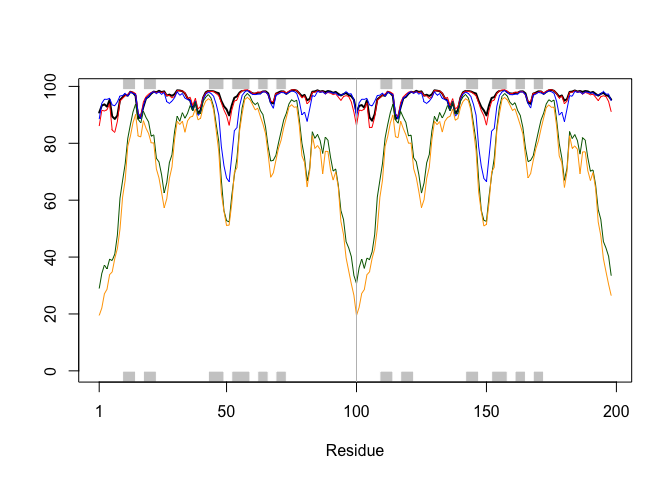
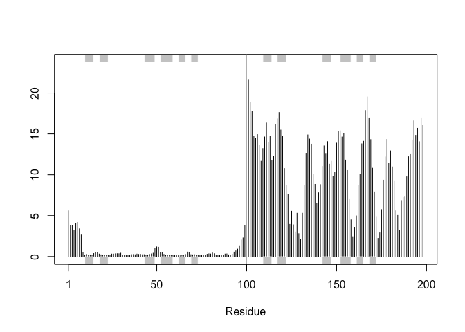
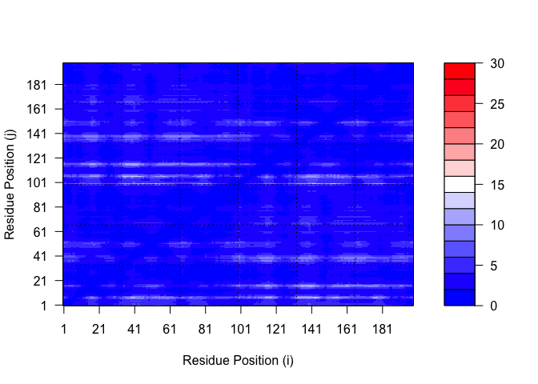

# class11
Kate Ruiz (PID: A17671200)

## Background

In this hands-on session we will utilize AlphaFold to predict protein
structure from sequence (Jumper et al. 2021).

Without the aid of such approaches, it can take years of expensive
laboratory work to determine the structure of just one protein. With
AlphaFold we can now accurately compute a typical protein structure in
as little as ten minutes.

The PDB database (the main repository of experimental structures) only
has ~ 250 thousand structures (we saw this in the last lab). The main
protein sequence database has over **200 million** sequences! Only 0.125
% of sequences have a known structure - this is called the “structure
knowledge gap”.

``` r
(250000/ 200000000) *100
```

    [1] 0.125

Structures are much harder to determine than sequences. They are
expensive. On average ~ \$1 million each. They take on averge 3-5 years
to solve.

## EBI AlphaFold Database

The EBI has a database of pre-computed Alpha Fold (AF) modles called
AFDB. This is growing all the time and can be useful to check before
eunning AF ourselves.

## Running AlphaFold

We can download and run locally (on our own computers) but we need a
GPU. Or we can use “cloud” computing to run this on someone else’s
computer :-)

We will use ColabFold \< https://github.com/sokrypton/ColabFold \>

We previously found there was no AFDB entry for our HIV sequence

    >HIV-Pr-Dimer
    PQITLWQRPLVTIKIGGQLKEALLDTGADDTVLEEMSLPGRWKPKMIGGIGGFIKVRQYDQILIEICGHKAIGTVLVGPTPVNIIGRNLLTQIGCTLNF:PQITLWQRPLVTIKIGGQLKEALLDTGADDTVLEEMSLPGRWKPKMIGGIGGFIKVRQYDQILIEICGHKAIGTVLVGPTPVNIIGRNLLTQIGCTLNF

Here we will use AlphaFold2_mmseqs2

# 8. Custom analysis of resulting models

``` r
library(bio3d)
library(pheatmap)
library(jsonlite)
results_dir <- "hivpr_23119/"
pdb_files <- list.files(path=results_dir,
pattern="*.pdb",
full.names = TRUE)
# Print our PDB file names
basename(pdb_files)
```

    [1] "hivpr_23119_unrelaxed_rank_001_alphafold2_multimer_v3_model_4_seed_000.pdb"
    [2] "hivpr_23119_unrelaxed_rank_002_alphafold2_multimer_v3_model_1_seed_000.pdb"
    [3] "hivpr_23119_unrelaxed_rank_003_alphafold2_multimer_v3_model_5_seed_000.pdb"
    [4] "hivpr_23119_unrelaxed_rank_004_alphafold2_multimer_v3_model_2_seed_000.pdb"
    [5] "hivpr_23119_unrelaxed_rank_005_alphafold2_multimer_v3_model_3_seed_000.pdb"

``` r
library(bio3d)
# Read all data from Models
# and superpose/fit coords
pdbs <- pdbaln(pdb_files, fit=TRUE, exefile="msa")
```

    Reading PDB files:
    hivpr_23119//hivpr_23119_unrelaxed_rank_001_alphafold2_multimer_v3_model_4_seed_000.pdb
    hivpr_23119//hivpr_23119_unrelaxed_rank_002_alphafold2_multimer_v3_model_1_seed_000.pdb
    hivpr_23119//hivpr_23119_unrelaxed_rank_003_alphafold2_multimer_v3_model_5_seed_000.pdb
    hivpr_23119//hivpr_23119_unrelaxed_rank_004_alphafold2_multimer_v3_model_2_seed_000.pdb
    hivpr_23119//hivpr_23119_unrelaxed_rank_005_alphafold2_multimer_v3_model_3_seed_000.pdb
    .....

    Extracting sequences

    pdb/seq: 1   name: hivpr_23119//hivpr_23119_unrelaxed_rank_001_alphafold2_multimer_v3_model_4_seed_000.pdb 
    pdb/seq: 2   name: hivpr_23119//hivpr_23119_unrelaxed_rank_002_alphafold2_multimer_v3_model_1_seed_000.pdb 
    pdb/seq: 3   name: hivpr_23119//hivpr_23119_unrelaxed_rank_003_alphafold2_multimer_v3_model_5_seed_000.pdb 
    pdb/seq: 4   name: hivpr_23119//hivpr_23119_unrelaxed_rank_004_alphafold2_multimer_v3_model_2_seed_000.pdb 
    pdb/seq: 5   name: hivpr_23119//hivpr_23119_unrelaxed_rank_005_alphafold2_multimer_v3_model_3_seed_000.pdb 

``` r
pdbs
```

                                   1        .         .         .         .         50 
    [Truncated_Name:1]hivpr_2311   PQITLWQRPLVTIKIGGQLKEALLDTGADDTVLEEMSLPGRWKPKMIGGI
    [Truncated_Name:2]hivpr_2311   PQITLWQRPLVTIKIGGQLKEALLDTGADDTVLEEMSLPGRWKPKMIGGI
    [Truncated_Name:3]hivpr_2311   PQITLWQRPLVTIKIGGQLKEALLDTGADDTVLEEMSLPGRWKPKMIGGI
    [Truncated_Name:4]hivpr_2311   PQITLWQRPLVTIKIGGQLKEALLDTGADDTVLEEMSLPGRWKPKMIGGI
    [Truncated_Name:5]hivpr_2311   PQITLWQRPLVTIKIGGQLKEALLDTGADDTVLEEMSLPGRWKPKMIGGI
                                   ************************************************** 
                                   1        .         .         .         .         50 

                                  51        .         .         .         .         100 
    [Truncated_Name:1]hivpr_2311   GGFIKVRQYDQILIEICGHKAIGTVLVGPTPVNIIGRNLLTQIGCTLNFP
    [Truncated_Name:2]hivpr_2311   GGFIKVRQYDQILIEICGHKAIGTVLVGPTPVNIIGRNLLTQIGCTLNFP
    [Truncated_Name:3]hivpr_2311   GGFIKVRQYDQILIEICGHKAIGTVLVGPTPVNIIGRNLLTQIGCTLNFP
    [Truncated_Name:4]hivpr_2311   GGFIKVRQYDQILIEICGHKAIGTVLVGPTPVNIIGRNLLTQIGCTLNFP
    [Truncated_Name:5]hivpr_2311   GGFIKVRQYDQILIEICGHKAIGTVLVGPTPVNIIGRNLLTQIGCTLNFP
                                   ************************************************** 
                                  51        .         .         .         .         100 

                                 101        .         .         .         .         150 
    [Truncated_Name:1]hivpr_2311   QITLWQRPLVTIKIGGQLKEALLDTGADDTVLEEMSLPGRWKPKMIGGIG
    [Truncated_Name:2]hivpr_2311   QITLWQRPLVTIKIGGQLKEALLDTGADDTVLEEMSLPGRWKPKMIGGIG
    [Truncated_Name:3]hivpr_2311   QITLWQRPLVTIKIGGQLKEALLDTGADDTVLEEMSLPGRWKPKMIGGIG
    [Truncated_Name:4]hivpr_2311   QITLWQRPLVTIKIGGQLKEALLDTGADDTVLEEMSLPGRWKPKMIGGIG
    [Truncated_Name:5]hivpr_2311   QITLWQRPLVTIKIGGQLKEALLDTGADDTVLEEMSLPGRWKPKMIGGIG
                                   ************************************************** 
                                 101        .         .         .         .         150 

                                 151        .         .         .         .       198 
    [Truncated_Name:1]hivpr_2311   GFIKVRQYDQILIEICGHKAIGTVLVGPTPVNIIGRNLLTQIGCTLNF
    [Truncated_Name:2]hivpr_2311   GFIKVRQYDQILIEICGHKAIGTVLVGPTPVNIIGRNLLTQIGCTLNF
    [Truncated_Name:3]hivpr_2311   GFIKVRQYDQILIEICGHKAIGTVLVGPTPVNIIGRNLLTQIGCTLNF
    [Truncated_Name:4]hivpr_2311   GFIKVRQYDQILIEICGHKAIGTVLVGPTPVNIIGRNLLTQIGCTLNF
    [Truncated_Name:5]hivpr_2311   GFIKVRQYDQILIEICGHKAIGTVLVGPTPVNIIGRNLLTQIGCTLNF
                                   ************************************************ 
                                 151        .         .         .         .       198 

    Call:
      pdbaln(files = pdb_files, fit = TRUE, exefile = "msa")

    Class:
      pdbs, fasta

    Alignment dimensions:
      5 sequence rows; 198 position columns (198 non-gap, 0 gap) 

    + attr: xyz, resno, b, chain, id, ali, resid, sse, call

``` r
rd <- rmsd(pdbs, fit=T)
```

    Warning in rmsd(pdbs, fit = T): No indices provided, using the 198 non NA positions

``` r
range(rd)
```

    [1]  0.000 14.754

``` r
library(pheatmap)
colnames(rd) <- paste0("m",1:5)
rownames(rd) <- paste0("m",1:5)
pheatmap(rd)
```


``` r
# Read a reference PDB structure
pdb <- read.pdb("1hsg")
```

      Note: Accessing on-line PDB file

``` r
plotb3(pdbs$b[1,], typ="l", lwd=2, sse=pdb)
points(pdbs$b[2,], typ="l", col="red")
points(pdbs$b[3,], typ="l", col="blue")
points(pdbs$b[4,], typ="l", col="darkgreen")
points(pdbs$b[5,], typ="l", col="orange")
abline(v=100, col="gray")
```



``` r
core <- core.find(pdbs)
```

     core size 197 of 198  vol = 9885.821 
     core size 196 of 198  vol = 6896.66 
     core size 195 of 198  vol = 1337.842 
     core size 194 of 198  vol = 1040.672 
     core size 193 of 198  vol = 951.859 
     core size 192 of 198  vol = 899.085 
     core size 191 of 198  vol = 834.735 
     core size 190 of 198  vol = 771.341 
     core size 189 of 198  vol = 733.067 
     core size 188 of 198  vol = 697.282 
     core size 187 of 198  vol = 659.744 
     core size 186 of 198  vol = 625.275 
     core size 185 of 198  vol = 589.542 
     core size 184 of 198  vol = 568.255 
     core size 183 of 198  vol = 545.016 
     core size 182 of 198  vol = 512.891 
     core size 181 of 198  vol = 490.725 
     core size 180 of 198  vol = 470.267 
     core size 179 of 198  vol = 450.732 
     core size 178 of 198  vol = 434.736 
     core size 177 of 198  vol = 420.338 
     core size 176 of 198  vol = 406.659 
     core size 175 of 198  vol = 393.335 
     core size 174 of 198  vol = 382.396 
     core size 173 of 198  vol = 372.859 
     core size 172 of 198  vol = 356.994 
     core size 171 of 198  vol = 346.568 
     core size 170 of 198  vol = 337.447 
     core size 169 of 198  vol = 326.659 
     core size 168 of 198  vol = 314.95 
     core size 167 of 198  vol = 304.128 
     core size 166 of 198  vol = 294.553 
     core size 165 of 198  vol = 285.649 
     core size 164 of 198  vol = 278.885 
     core size 163 of 198  vol = 266.766 
     core size 162 of 198  vol = 258.995 
     core size 161 of 198  vol = 247.723 
     core size 160 of 198  vol = 239.841 
     core size 159 of 198  vol = 234.963 
     core size 158 of 198  vol = 230.062 
     core size 157 of 198  vol = 221.985 
     core size 156 of 198  vol = 215.621 
     core size 155 of 198  vol = 206.793 
     core size 154 of 198  vol = 196.984 
     core size 153 of 198  vol = 188.54 
     core size 152 of 198  vol = 182.262 
     core size 151 of 198  vol = 176.954 
     core size 150 of 198  vol = 170.712 
     core size 149 of 198  vol = 166.12 
     core size 148 of 198  vol = 159.797 
     core size 147 of 198  vol = 153.767 
     core size 146 of 198  vol = 149.092 
     core size 145 of 198  vol = 143.657 
     core size 144 of 198  vol = 137.138 
     core size 143 of 198  vol = 132.517 
     core size 142 of 198  vol = 127.231 
     core size 141 of 198  vol = 121.574 
     core size 140 of 198  vol = 116.775 
     core size 139 of 198  vol = 112.57 
     core size 138 of 198  vol = 108.17 
     core size 137 of 198  vol = 105.133 
     core size 136 of 198  vol = 101.249 
     core size 135 of 198  vol = 97.374 
     core size 134 of 198  vol = 92.974 
     core size 133 of 198  vol = 88.184 
     core size 132 of 198  vol = 84.029 
     core size 131 of 198  vol = 81.898 
     core size 130 of 198  vol = 78.019 
     core size 129 of 198  vol = 75.272 
     core size 128 of 198  vol = 73.052 
     core size 127 of 198  vol = 70.695 
     core size 126 of 198  vol = 68.975 
     core size 125 of 198  vol = 66.694 
     core size 124 of 198  vol = 64.394 
     core size 123 of 198  vol = 62.092 
     core size 122 of 198  vol = 59.045 
     core size 121 of 198  vol = 56.629 
     core size 120 of 198  vol = 54.016 
     core size 119 of 198  vol = 51.805 
     core size 118 of 198  vol = 49.652 
     core size 117 of 198  vol = 48.193 
     core size 116 of 198  vol = 46.648 
     core size 115 of 198  vol = 44.752 
     core size 114 of 198  vol = 43.292 
     core size 113 of 198  vol = 41.093 
     core size 112 of 198  vol = 39.147 
     core size 111 of 198  vol = 36.471 
     core size 110 of 198  vol = 34.117 
     core size 109 of 198  vol = 31.47 
     core size 108 of 198  vol = 29.447 
     core size 107 of 198  vol = 27.325 
     core size 106 of 198  vol = 25.822 
     core size 105 of 198  vol = 24.15 
     core size 104 of 198  vol = 22.648 
     core size 103 of 198  vol = 21.069 
     core size 102 of 198  vol = 19.953 
     core size 101 of 198  vol = 18.3 
     core size 100 of 198  vol = 15.723 
     core size 99 of 198  vol = 14.841 
     core size 98 of 198  vol = 11.646 
     core size 97 of 198  vol = 9.434 
     core size 96 of 198  vol = 7.354 
     core size 95 of 198  vol = 6.179 
     core size 94 of 198  vol = 5.665 
     core size 93 of 198  vol = 4.705 
     core size 92 of 198  vol = 3.665 
     core size 91 of 198  vol = 2.77 
     core size 90 of 198  vol = 2.151 
     core size 89 of 198  vol = 1.715 
     core size 88 of 198  vol = 1.15 
     core size 87 of 198  vol = 0.874 
     core size 86 of 198  vol = 0.685 
     core size 85 of 198  vol = 0.528 
     core size 84 of 198  vol = 0.37 
     FINISHED: Min vol ( 0.5 ) reached

``` r
core.inds <- print(core, vol=0.5)
```

    # 85 positions (cumulative volume <= 0.5 Angstrom^3) 
      start end length
    1     9  49     41
    2    52  95     44

``` r
xyz <- pdbfit(pdbs, core.inds, outpath="corefit_structures")
```

``` r
rf <- rmsf(xyz)
plotb3(rf, sse=pdb)
abline(v=100, col="gray", ylab="RMSF")
```



## Predicted Alignment Error for domains

``` r
library(jsonlite)

# Listing of all PAE JSON files
pae_files <- list.files(path=results_dir,
                        pattern=".*model.*\\.json",
                        full.names = TRUE)
```

``` r
pae1 <- read_json(pae_files[1],simplifyVector = TRUE)
pae5 <- read_json(pae_files[5],simplifyVector = TRUE)

attributes(pae1)
```

    $names
    [1] "plddt"   "max_pae" "pae"     "ptm"     "iptm"   

``` r
# Per-residue pLDDT scores 
#  same as B-factor of PDB..
head(pae1$plddt) 
```

    [1] 90.81 93.25 93.69 92.88 95.25 89.44

``` r
pae1$max_pae
```

    [1] 12.84375

``` r
pae5$max_pae
```

    [1] 29.59375

``` r
plot.dmat(pae1$pae, 
          xlab="Residue Position (i)",
          ylab="Residue Position (j)")
```


``` r
plot.dmat(pae5$pae, 
          xlab="Residue Position (i)",
          ylab="Residue Position (j)",
          grid.col = "black",
          zlim=c(0,30))
```


``` r
plot.dmat(pae1$pae, 
          xlab="Residue Position (i)",
          ylab="Residue Position (j)",
          grid.col = "black",
          zlim=c(0,30))
```



# Residue conservation from alignment file

``` r
aln_file <- list.files(path=results_dir,
                       pattern=".a3m$",
                        full.names = TRUE)
aln_file
```

    [1] "hivpr_23119//hivpr_23119.a3m"

``` r
aln <- read.fasta(aln_file[1], to.upper = TRUE)
```

    [1] " ** Duplicated sequence id's: 101 **"
    [2] " ** Duplicated sequence id's: 101 **"

``` r
dim(aln$ali)
```

    [1] 5397  132

``` r
sim <- conserv(aln)
```

``` r
plotb3(sim[1:99], sse=trim.pdb(pdb, chain="A"),
       ylab="Conservation Score")
```


``` r
con <- consensus(aln, cutoff = 0.9)
con$seq
```

      [1] "-" "-" "-" "-" "-" "-" "-" "-" "-" "-" "-" "-" "-" "-" "-" "-" "-" "-"
     [19] "-" "-" "-" "-" "-" "-" "D" "T" "G" "A" "-" "-" "-" "-" "-" "-" "-" "-"
     [37] "-" "-" "-" "-" "-" "-" "-" "-" "-" "-" "-" "-" "-" "-" "-" "-" "-" "-"
     [55] "-" "-" "-" "-" "-" "-" "-" "-" "-" "-" "-" "-" "-" "-" "-" "-" "-" "-"
     [73] "-" "-" "-" "-" "-" "-" "-" "-" "-" "-" "-" "-" "-" "-" "-" "-" "-" "-"
     [91] "-" "-" "-" "-" "-" "-" "-" "-" "-" "-" "-" "-" "-" "-" "-" "-" "-" "-"
    [109] "-" "-" "-" "-" "-" "-" "-" "-" "-" "-" "-" "-" "-" "-" "-" "-" "-" "-"
    [127] "-" "-" "-" "-" "-" "-"

``` r
m1.pdb <- read.pdb(pdb_files[1])
occ <- vec2resno(c(sim[1:99], sim[1:99]), m1.pdb$atom$resno)
write.pdb(m1.pdb, o=occ, file="m1_conserv.pdb")
```
